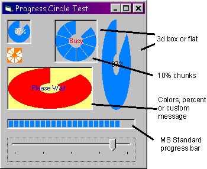



## Progress Circle

### Description

Progress bars are quite standard... but boring to look at! So how about a Progress Circle? This works just like MS progress bar AND has several enhancements such a colours and captions. I have included the code for the ocx control as well as the test app shown in the screen shot.
 
### More Info
 

             |
---                |---
**Submitted On**   |2004-05-24 22:56:20
**By**             |[Paul Bahlawan](https://github.com/Planet-Source-Code/PSCIndex/blob/master/ByAuthor/paul-bahlawan.md)
**Level**          |Intermediate
**User Rating**    |4.8 (53 globes from 11 users)
**Compatibility**  |VB 6\.0
**Category**       |[Custom Controls/ Forms/  Menus](https://github.com/Planet-Source-Code/PSCIndex/blob/master/ByCategory/custom-controls-forms-menus__1-4.md)
**World**          |[Visual Basic](https://github.com/Planet-Source-Code/PSCIndex/blob/master/ByWorld/visual-basic.md)
**Archive File**   |[Progress\_C1749865242004\.zip](https://github.com/Planet-Source-Code/paul-bahlawan-progress-circle__1-54004/archive/master.zip)

